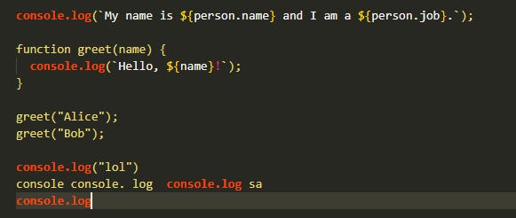

# "Console.log" Highlighter

An extension that will color your word "console.log" to orangish red in your javascript/typescript file.

## Features Examples

- ### Here is a result of the extension.

- 

## Requirements

Your file must be set to typescript/javascript to activate this extension.
Then start writing some code and it will change the color of all "Console.log" and will be **CASE INSENSITIVE**

## Release Notes

Current Version: v0.0.1

# **Enjoy!**
